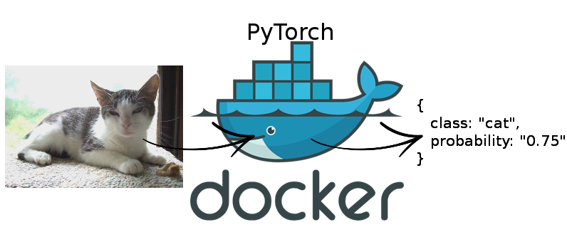

# PyTorch machine learning GPU inference using Docker and Flask

This project illustrates how to serve a PyTorch model as a REST API using a simple CIFAR model for illustration from
the [PyTorch CIFAR tutorial](https://pytorch.org/tutorials/beginner/blitz/cifar10_tutorial.html).

This is done using Flask, Docker and PyTorch.

## Blog post on paepper.com/blog

For full details about the approach and how to run it yourself, see my [blog post covering the details](https://www.paepper.com/blog/posts/pytorch-gpu-inference-with-docker/)
